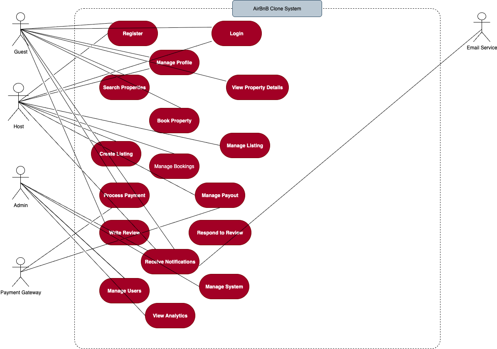

# AirBnB Use Case Diagram (Preview)

---

## Use Case Relationships

- **Guest:** Can register, login, search properties, make bookings, write reviews, and receive notifications.
- **Host:** Can perform all guest actions plus create/manage listings, handle bookings, and manage payouts.
- **Admin:** Has system-wide access to manage users, monitor system health, and view analytics.
- **Payment Gateway:** External system that processes payments and manages financial transactions.
- **Email Service:** External service that handles all notification delivery.

---

## Key Interactions
1. **Registration & Authentication:** All users must register and authenticate to access system features.
2. **Property Management:** Hosts create and manage property listings with detailed information.
3. **Booking Process:** Guests search, view, and book properties with integrated payment processing.
4. **Review System:** Post-booking review and rating system for quality assurance.
5. **Administrative Oversight:** Comprehensive admin controls for system management.